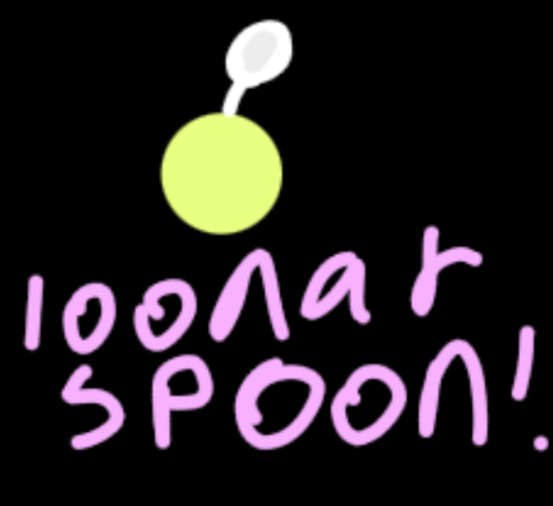

># loonarspoon



# let's get this stuff out of the way

## why loonarspoon?
why not?
ok, but jokes aside...
this is the *actual* perfect programming language. no weird const const const here...

## how do i install loonarspoon?
installing loonarspoon is a perfected process.

that's why we've hired a totally real person to explain how.
here you go!

"here's a quick guide to get you started with installing the loonarspoon programming language. first, navigate to the official loonarspoon website and find the download section. you'll see several installer options based on your operating system. choose the appropriate installer, which will then download another installer. this second installer will set up yet another installer, and so on. just follow the prompts at each stage, embracing the process. if you encounter any issues, the loonarspoon community is always ready to help. there's like 4 installers. happy coding with loonarspoon!"

now that's out the way...

# wait, how do i use loonarspoon

As a wise human once said!
> You don't.

But here...
> You do!

## Printing

hello, world! wait... how do i say that in loonar?
```java
print("hello, world!")*
```

wait, what?! *!?
why is there a *!?!?!
what witchery is this?!?

## why *

For centuries, there has been one main battle between programming languages: do you end with a ;? A ,? A

?

We aim to solve this problem by simply beating all the rest. Introducing *.

For when you're feeling happy.

Or sad.

OR LIKE EVERYTHING ******* SUCKS AND YOU JUST WANT TO CODE BUT YOUR ***** FRIENDS KEEP ON TEXTING YOU!!!

The * is there for everything.

## Variables

Managing variables is silly. What is const and var? But how do variables pop out of nowhere but not work in functions? And what the hell is a bigint and why can't I use a microint instead?

In Loonar, it's simple. Have a long, long, long, long, long, long, long, long look.


```java
var idiot != "you!" *
var smart_person == "you!" *
```

> "Wait but wait but how the == and the != but the wait but the with the you but the string and the var with the" - Probably you, right now

Let's break it down!
!= means it is not equal to. So, `var hello != "humans"` and then running `does hello == "world"` would output true. But `does hello == "mars"` would also equal true. ( * omitted, i cannot be bothered)

So... == is assignment like normal?
Yes. What made you think this was any diff-

SIKE!

It's like normal, technically. But, you can also...

```java
var what_youre_saying_rn == "what in","the fresh hell","is this",1,"stupid language?" *
```

And all of a sudden...
 ```java
var wysrn == what_youre_saying_rn *
does wsyrn == "is this" * // true 
does wsyrn == "the fresh hell" *// true
does wsyrn == 1 * // true
does wsyrn == "1" * // true
```

Glorious, glorious multi definitions.
